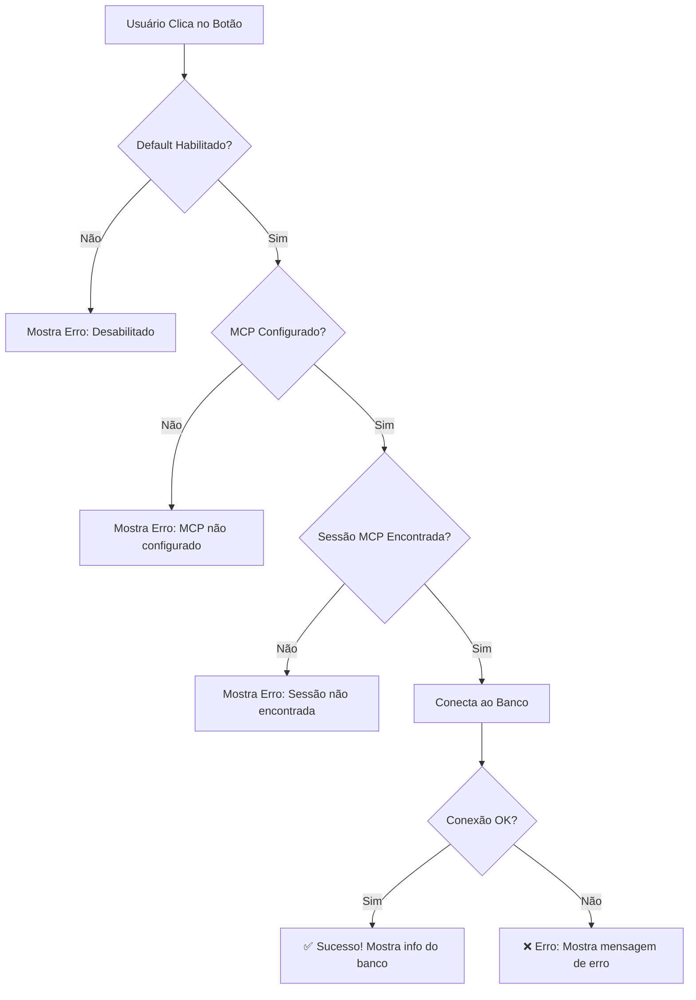

# 🔌 Conexão Default MCP - Guia Completo

## 📋 Visão Geral

Este guia explica como usar o sistema de **Conexão Default MCP**, que permite conectar rapidamente aos bancos de dados configurados com um único clique!

---

## 🎯 O que é?

**Conexão Default MCP** é um sistema que:
- ✅ Permite configurar bancos de dados "padrão" no arquivo `.env`
- ✅ Oferece botões de conexão rápida no chat
- ✅ Conecta automaticamente sem precisar digitar credenciais
- ✅ Suporta **MS SQL Server** e **PostgreSQL**
- ✅ É completamente editável e configurável

---

## 🚀 Como Usar

### **Forma Mais Rápida: Botões no Chat**

1. **Inicie uma nova conversa** com Gabi.
2. **Veja os botões** na mensagem de boas-vindas:
   - 🔌 **Conectar MSSQL Default**
   - 🐘 **Conectar PostgreSQL Default**
   - ❓ **Help MCP**
   - 📊 **Ver Exemplos**

3. **Clique em "Conectar MSSQL Default"** ou **"Conectar PostgreSQL Default"**
4. ✅ **Pronto!** Você está conectado!

### **Confirmação de Conexão**

Após conectar, você verá:
```
✅ Conexão Default MSSQL Bem-Sucedida!

Conectado a mssql/REB_BI_IA (15 tabelas)

📋 Banco configurado:
• Servidor: mssql:1433
• Database: REB_BI_IA

💡 Agora você pode:
• Listar tabelas: "Quais tabelas existem?"
• Consultar dados: "Mostre os dados da tabela X"
• Analisar schema: "Qual a estrutura da tabela Y?"
```

---

## 🔧 Configurar Banco Default

Os bancos default são configurados no arquivo `.env` (ou `.env.example` para referência).

### **Localização do Arquivo**

```bash
/home/user/chatREBrasil/.env
```

### **Configurações para MS SQL Server**

```bash
# ==================== MSSQL DEFAULT CONNECTION ====================
# Configuração do banco MS SQL Server padrão para conexão rápida
# Edite estes valores para conectar automaticamente ao seu banco
MSSQL_DEFAULT_ENABLED=true              # true ou false
MSSQL_DEFAULT_SERVER=mssql              # Endereço do servidor
MSSQL_DEFAULT_PORT=1433                 # Porta (padrão: 1433)
MSSQL_DEFAULT_DATABASE=REB_BI_IA        # Nome da database
MSSQL_DEFAULT_USERNAME=sa               # Usuário
MSSQL_DEFAULT_PASSWORD=Str0ng!Passw0rd  # Senha
```

### **Configurações para PostgreSQL**

```bash
# ==================== POSTGRESQL DEFAULT CONNECTION ====================
# Configuração do banco PostgreSQL padrão para conexão rápida
POSTGRES_DEFAULT_ENABLED=true        # true ou false
POSTGRES_DEFAULT_HOST=db-persist     # Host/endereço
POSTGRES_DEFAULT_PORT=5432           # Porta (padrão: 5432)
POSTGRES_DEFAULT_DATABASE=chainlit   # Nome da database
POSTGRES_DEFAULT_USERNAME=chainlit   # Usuário
POSTGRES_DEFAULT_PASSWORD=chainlit   # Senha
```

---

## 📝 Exemplos de Configuração

### **Exemplo 1: Conectar ao SQL Server da Empresa**

```bash
MSSQL_DEFAULT_ENABLED=true
MSSQL_DEFAULT_SERVER=sql.minhaempresa.com
MSSQL_DEFAULT_PORT=1433
MSSQL_DEFAULT_DATABASE=Producao
MSSQL_DEFAULT_USERNAME=app_user
MSSQL_DEFAULT_PASSWORD=SenhaSegura123!
```

### **Exemplo 2: Conectar ao PostgreSQL Local**

```bash
POSTGRES_DEFAULT_ENABLED=true
POSTGRES_DEFAULT_HOST=localhost
POSTGRES_DEFAULT_PORT=5432
POSTGRES_DEFAULT_DATABASE=meu_banco
POSTGRES_DEFAULT_USERNAME=postgres
POSTGRES_DEFAULT_PASSWORD=postgres
```

### **Exemplo 3: Desabilitar Banco Default**

```bash
MSSQL_DEFAULT_ENABLED=false     # Desabilita MSSQL default
POSTGRES_DEFAULT_ENABLED=false  # Desabilita PostgreSQL default
```

Quando desabilitado, o botão ainda aparece, mas mostrará uma mensagem explicando que está desabilitado.

---

## 🔄 Aplicar Alterações

Após editar o `.env`, você precisa **reiniciar a aplicação**:

```bash
# Opção 1: Reiniciar apenas o app
docker-compose restart app-agent

# Opção 2: Reiniciar tudo (se mudou banco de dados)
docker-compose down
docker-compose up -d

# Opção 3: Ver logs após reiniciar
docker-compose restart app-agent && docker-compose logs -f app-agent
```

---

## 💡 Dicas e Boas Práticas

### **1. Nomes Descritivos**

Use nomes que identifiquem claramente o banco:
```bash
MSSQL_DEFAULT_DATABASE=Producao_Vendas  # Bom!
MSSQL_DEFAULT_DATABASE=DB1              # Evite
```

### **2. Segurança de Senhas**

⚠️ **IMPORTANTE:** O arquivo `.env` contém senhas em texto claro!

**Recomendações:**
- ✅ Nunca commite `.env` no git (já está no `.gitignore`)
- ✅ Use senhas fortes
- ✅ Rotacione senhas regularmente
- ✅ Use usuários com permissões mínimas (somente SELECT)

### **3. Múltiplos Ambientes**

Para diferentes ambientes, crie arquivos separados:

```bash
.env.development   # Desenvolvimento local
.env.staging       # Homologação
.env.production    # Produção

# Use o arquivo apropriado:
cp .env.production .env
docker-compose restart app-agent
```

### **4. Teste Antes de Usar**

Teste a conexão manual primeiro:

```bash
# Testar MSSQL
docker exec -it chatrebrasil-mssql-1 /opt/mssql-tools18/bin/sqlcmd \
  -S mssql -U sa -P 'Str0ng!Passw0rd' -C

# Testar PostgreSQL
docker exec -it chatrebrasil-db-persist-1 psql \
  -h db-persist -U chainlit -d chainlit
```

---

## 🛡️ Segurança e Permissões

### **Permissões Recomendadas**

O usuário configurado deve ter APENAS permissões de leitura:

#### **MS SQL Server:**
```sql
-- Criar usuário read-only
CREATE LOGIN gabi_readonly WITH PASSWORD = 'SenhaForte123!';
CREATE USER gabi_readonly FOR LOGIN gabi_readonly;

-- Dar permissão de SELECT em todas as tabelas
GRANT SELECT ON SCHEMA::dbo TO gabi_readonly;
```

#### **PostgreSQL:**
```sql
-- Criar usuário read-only
CREATE USER gabi_readonly WITH PASSWORD 'SenhaForte123!';

-- Dar permissão de SELECT
GRANT CONNECT ON DATABASE sua_database TO gabi_readonly;
GRANT USAGE ON SCHEMA public TO gabi_readonly;
GRANT SELECT ON ALL TABLES IN SCHEMA public TO gabi_readonly;
```

### **O que é Bloqueado Automaticamente**

Gabi. bloqueia automaticamente:
- ❌ `INSERT`, `UPDATE`, `DELETE`
- ❌ `DROP`, `TRUNCATE`, `ALTER`
- ❌ `EXEC`, `xp_cmdshell`
- ❌ Stored procedures destrutivas

---

## 🎛️ Botões e Actions Disponíveis

Quando você inicia uma conversa, Gabi. oferece 4 botões:

| Botão | Descrição | Quando Usar |
|-------|-----------|-------------|
| 🔌 **Conectar MSSQL Default** | Conecta ao MS SQL Server configurado | Quando precisa acessar dados de negócio |
| 🐘 **Conectar PostgreSQL Default** | Conecta ao PostgreSQL configurado | Quando quer ver histórico de chats |
| ❓ **Help MCP** | Tutorial completo sobre MCP | Primeira vez usando ou tem dúvidas |
| 📊 **Ver Exemplos** | Exemplos de consultas | Inspiração para perguntas |

---

## 📊 Fluxo de Conexão



---

## 🆘 Troubleshooting

### **Problema: Botão não aparece**

**Possíveis causas:**
1. Não iniciou uma nova conversa
2. Código desatualizado

**Solução:**
```bash
# Certifique-se que está na branch correta
git pull
docker-compose build app-agent
docker-compose up -d
```

### **Problema: Erro "Default desabilitado"**

**Causa:** `MSSQL_DEFAULT_ENABLED=false` no `.env`

**Solução:**
```bash
# Edite o .env
nano .env

# Mude para:
MSSQL_DEFAULT_ENABLED=true

# Reinicie
docker-compose restart app-agent
```

### **Problema: Erro "MCP não configurado"**

**Causa:** MCP não está configurado no `.chainlit/config.toml`

**Solução:**
```bash
# Verifique se existe a seção [mcp]
cat .chainlit/config.toml | grep -A 10 "\[mcp\]"

# Deve mostrar:
# [mcp]
# [mcp.servers.mssql]
# command = "python"
# args = ["/app/mcp_sqlserver_stdio.py"]
```

### **Problema: Erro "Sessão MCP não encontrada"**

**Causa:** O servidor MCP não está rodando

**Solução:**
```bash
# Veja os logs
docker-compose logs app-agent | grep -i mcp

# Reinicie
docker-compose restart app-agent

# Aguarde ~10 segundos e tente novamente
```

### **Problema: Erro ao conectar ao banco**

**Possíveis causas:**
1. Credenciais incorretas
2. Banco não está rodando
3. Firewall bloqueando

**Solução:**
```bash
# 1. Teste conexão manual
docker exec -it chatrebrasil-mssql-1 /opt/mssql-tools18/bin/sqlcmd \
  -S mssql -U sa -P 'Str0ng!Passw0rd' -C

# 2. Verifique se o banco está rodando
docker-compose ps

# 3. Veja logs do banco
docker-compose logs mssql

# 4. Verifique credenciais no .env
cat .env | grep MSSQL_DEFAULT
```

---

## 📖 Documentação Relacionada

- **`MCP_SETUP.md`** - Setup completo do MCP
- **`PERSISTENCIA_E_BARRA_LATERAL.md`** - Sobre persistência e barra lateral
- **`MELHORIAS_IMPLEMENTADAS.md`** - Todas as melhorias do sistema
- **`.env.example`** - Template de configuração

---

## 🎓 Exemplos de Uso Após Conectar

### **Após conectar ao MSSQL:**

```
# Listar tabelas
"Quais tabelas existem no banco?"
"Liste todas as tabelas do schema dbo"

# Explorar estrutura
"Qual a estrutura da tabela Properties?"
"Mostre as colunas da tabela Transactions"

# Consultar dados
"Mostre os 10 primeiros registros da tabela Properties"
"Quantos registros tem a tabela Transactions?"

# Análise de dados
"Quais são os 5 imóveis mais caros?"
"Liste imóveis com área maior que 100m²"
"Calcule o valor médio dos imóveis"
```

### **Após conectar ao PostgreSQL:**

```
# Ver histórico de chats
"Mostre meus últimos 10 chats"
"Quantas conversas tenho salvas?"

# Explorar estrutura do Chainlit
"Quais tabelas o Chainlit usa?"
"Mostre a estrutura da tabela threads"

# Análise de uso
"Quantas mensagens enviei hoje?"
"Qual foi minha primeira conversa?"
"Liste todos os meus chats de ontem"
```

---

## ✨ Benefícios do Sistema Default

| Antes | Depois |
|-------|--------|
| ❌ Digitar credenciais manualmente | ✅ Um clique conecta |
| ❌ Lembrar servidor, porta, database | ✅ Tudo pré-configurado |
| ❌ Risco de erro de digitação | ✅ Configuração testada |
| ❌ Processo lento e repetitivo | ✅ Conexão instantânea |
| ❌ Sem help integrado | ✅ Help completo no chat |

---

## 🔐 Checklist de Segurança

Antes de usar em produção, verifique:

- [ ] ✅ `.env` está no `.gitignore`
- [ ] ✅ Senhas são fortes e únicas
- [ ] ✅ Usuários tem apenas permissão SELECT
- [ ] ✅ Conexões usam SSL/TLS quando possível
- [ ] ✅ Logs não expõem credenciais
- [ ] ✅ Acesso ao `.env` é restrito (chmod 600)
- [ ] ✅ Senhas são rotacionadas regularmente
- [ ] ✅ Backup do `.env` está seguro

---

## 🚀 Próximos Passos

1. **Configure seu banco default** editando `.env`
2. **Reinicie a aplicação** com `docker-compose restart`
3. **Teste a conexão** clicando no botão
4. **Explore os dados** com perguntas naturais!

---

**Dúvidas?** Clique no botão "❓ Help MCP" no chat ou pergunte diretamente:
*"Como configurar banco default?"*

**Gabi. está aqui para ajudar!** 🤖
